# LeadMaster AI — Backend

Production-ready FastAPI backend for LeadMaster AI: JWT auth with RBAC, a
34-table PostgreSQL schema, Redis-backed caching/rate-limiting/OTP,
Celery background jobs, real Stripe billing, real Google Maps/OAuth
integrations, file storage, and a full REST API surface (104 routes)
matching the Next.js frontend in this repo.

## Contents

- [Architecture](#architecture)
- [Database schema](#database-schema--er-diagram)
- [Setup — local development](#setup--local-development)
- [Setup — Docker](#setup--docker)
- [Environment variables](#environment-variables)
- [API documentation](#api-documentation)
- [Running tests](#running-tests)
- [What's real vs. what needs your API keys](#whats-real-vs-what-needs-your-api-keys)
- [Deployment](#deployment)

## Architecture

```
backend/
├── api/               FastAPI routers
│   ├── deps.py          shared dependencies: get_current_user, RBAC gates
│   └── v1/               versioned routes (/api/v1/...), one file per domain
├── auth/               JWT, password hashing, OTP, Google OAuth
├── config/             Pydantic Settings, logging config
├── database/            async engine/session (+ sync_session.py for Celery)
├── models/              SQLAlchemy 2.0 ORM models (source of truth for schema)
├── migrations/          Alembic migrations (autogenerated from models/)
├── schemas/              Pydantic request/response models
├── services/              business logic (one file per domain, called by routers)
├── repositories/           thin query-building helpers over models/
├── middleware/              rate limiting (Redis), request logging
├── notifications/            email, Celery app + tasks
├── payment/                    Stripe client wrapper
├── redis_cache/                  Redis client/pool
├── uploads/                       local file storage (dev) — see services/storage.py
├── scripts/                        seed_data.py, check_infra.py, run_local_redis.py
├── tests/                           pytest suite (real Postgres, dedicated test DB)
├── docker/                           Dockerfile, gunicorn.conf.py
└── main.py                           FastAPI app factory / entrypoint
```

**Request flow:** `api/v1/*.py` (routing, dependency injection) → `services/*.py`
(business logic, transactions) → `repositories/*.py` or direct ORM queries →
`models/*.py`. Every business table carries an `organization_id` — routes
resolve the caller's active org via `api.deps.get_current_organization` and
every query is scoped to it, so one workspace can never see another's data
(covered by `tests/test_leads.py::test_leads_are_isolated_between_organizations`).

## Database schema — ER diagram

34 tables across 8 domains. Full detail is in `models/*.py` (each file is a
domain); the high-level relationships:

```mermaid
erDiagram
    USERS ||--o| USER_PROFILES : has
    USERS ||--o{ ORGANIZATION_MEMBERS : "belongs to"
    USERS ||--o{ OAUTH_ACCOUNTS : links
    USERS }o--|| ROLES : has
    ROLES ||--o{ ROLE_PERMISSIONS : grants
    PERMISSIONS ||--o{ ROLE_PERMISSIONS : "granted via"

    ORGANIZATIONS ||--o{ ORGANIZATION_MEMBERS : has
    ORGANIZATIONS ||--o{ TEAM_INVITATIONS : sends
    ORGANIZATIONS ||--o{ LEADS : owns
    ORGANIZATIONS ||--o{ SEARCHES : runs
    ORGANIZATIONS ||--o{ WEBSITE_SCANS : runs
    ORGANIZATIONS ||--o{ EXPORTS : creates
    ORGANIZATIONS ||--|| CREDIT_WALLETS : has
    ORGANIZATIONS ||--|| SUBSCRIPTIONS : has
    ORGANIZATIONS ||--o{ PAYMENTS : makes
    ORGANIZATIONS ||--o{ INVOICES : receives
    ORGANIZATIONS ||--o{ API_KEYS : issues
    ORGANIZATIONS ||--o{ DOCUMENTS : stores

    COMPANIES ||--o{ LEADS : "matched to"
    LEADS ||--o{ LEAD_NOTES : has
    LEADS ||--o{ LEAD_ACTIVITIES : has
    LEADS }o--o| API_PROVIDERS : "sourced from"
    SEARCHES ||--o{ SEARCH_PROVIDER_RUNS : has
    SEARCHES ||--o{ LEADS : produces

    SUBSCRIPTIONS }o--|| SUBSCRIPTION_PLANS : uses
    PAYMENTS ||--o{ TRANSACTIONS : records
    SUBSCRIPTIONS ||--o{ INVOICES : generates

    USERS ||--o{ NOTIFICATIONS : receives
    USERS ||--o{ NOTIFICATION_PREFERENCES : sets
    USERS ||--o{ ACTIVITY_LOGS : "audit trail for"
```



Every table uses a UUID primary key, `created_at`/`updated_at` timestamps
(server-maintained), and named constraints (see `database/base.py`'s
`NAMING_CONVENTION`) so Alembic diffs stay stable and readable.

## Setup — local development

This sandbox had no admin rights to install Docker Desktop (needs WSL2) or
run the standard Windows installers for PostgreSQL/Redis (both need UAC
elevation). What's actually running and verified in this repo instead:

- **PostgreSQL 17** — portable (no-installer) binaries under `.devtools/pgsql`,
  data directory at `.devtools/pgdata`, **not** committed to git.
- **Redis** — `fakeredis`'s real TCP/RESP server (`scripts/run_local_redis.py`)
  standing in for a real Redis server in dev — the app talks to it through
  the exact same `redis` Python client it uses in production, so this is
  transparent to application code. Production `docker-compose.yml` uses the
  real `redis:7-alpine` image.

**On a normal machine with admin rights, just use Docker** (see below) —
that's simpler. To reproduce this sandbox's setup instead:

```powershell
# 1. Python deps
cd backend
python -m venv venv
.\venv\Scripts\pip install -r requirements.txt

# 2. PostgreSQL — download the portable zip and initialize a data dir
#    (or install normally if you have admin rights)
#    Then create the app role + database:
psql -h 127.0.0.1 -U postgres -c "CREATE ROLE leadmaster WITH LOGIN PASSWORD 'leadmaster' CREATEDB;"
psql -h 127.0.0.1 -U postgres -c "CREATE DATABASE leadmaster OWNER leadmaster;"

# 3. Redis — either a real local Redis/Memurai, or for dev-only:
.\venv\Scripts\python scripts\run_local_redis.py

# 4. Configure environment
copy .env.example .env
# .env already has working defaults for local Postgres/Redis; fill in
# STRIPE_*/GOOGLE_*/SMTP_* only when you're ready to use those features.

# 5. Apply the schema
.\venv\Scripts\python -m alembic upgrade head

# 6. Seed reference data (roles, permissions, plans, provider catalogue)
.\venv\Scripts\python -m scripts.seed_data

# 7. Run the API
.\venv\Scripts\python -m uvicorn main:app --reload --port 8000
```

Visit `http://localhost:8000/docs` for interactive Swagger docs.

Background workers (optional for basic API testing, required for async
email notifications):

```powershell
.\venv\Scripts\celery -A notifications.celery_app worker --loglevel=info --pool=solo
.\venv\Scripts\celery -A notifications.celery_app beat --loglevel=info
```

## Setup — Docker

On a machine with Docker installed, this is the whole setup:

```bash
cp backend/.env.example backend/.env    # fill in real secrets as needed
docker compose up --build
```

This starts Postgres, Redis, the API (after running `alembic upgrade head`),
a Celery worker + beat scheduler, the Next.js frontend, and an Nginx
reverse proxy (`docker/nginx.conf`) fronting everything on port 80 —
`/api/*` and `/docs` route to the backend, everything else to the frontend.
Seed reference data once the stack is up:

```bash
docker compose exec backend python -m scripts.seed_data
```

*Note: `docker compose up` itself was not executed in this sandbox (no
Docker available — see above). Every individual piece it orchestrates
(Postgres+Alembic, the FastAPI app under gunicorn/uvicorn, Celery+Redis,
the Next.js standalone build) has been run and verified directly; the
Dockerfiles/compose file were reviewed carefully for correctness but the
full containerized stack itself is unverified end-to-end.*

## Environment variables

See `.env.example` for the full list with comments. Summary:

| Variable | Required for | Notes |
|---|---|---|
| `POSTGRES_*` | Everything | Defaults work for the local setup above |
| `REDIS_*` | Everything | Defaults work for the local setup above |
| `JWT_SECRET_KEY` | Everything | **Change in production** — generate with `python -c "import secrets; print(secrets.token_urlsafe(64))"` |
| `STRIPE_SECRET_KEY`, `STRIPE_PUBLISHABLE_KEY`, `STRIPE_WEBHOOK_SECRET` | Billing (`/api/v1/billing/*`) | Get free test keys at dashboard.stripe.com/test/apikeys — until set, checkout/webhook endpoints return a clear 400 instead of failing silently |
| `GOOGLE_CLIENT_ID`, `GOOGLE_CLIENT_SECRET` | Google OAuth login | console.cloud.google.com/apis/credentials |
| `GOOGLE_MAPS_API_KEY` | Geocoding, Places, Distance Matrix (`/api/v1/map/*`, except `/nearby-leads` which works with no key) | console.cloud.google.com/google/maps-apis |
| `SMTP_*` | Sending real emails | Until set, emails are logged instead of sent (visible in server logs) — everything else keeps working |
| `FRONTEND_URL` | Email links, OAuth redirects, CORS | Defaults to `http://localhost:3000` |

## API documentation

Full interactive documentation is auto-generated by FastAPI:
- Swagger UI: `/docs`
- ReDoc: `/redoc`
- Raw OpenAPI spec: `/openapi.json`

104 routes across: Auth, Leads, Search, Dashboard, Analytics, Billing,
Files, Notifications, Map, Admin, Settings, Team. All list endpoints
support pagination (`page`, `page_size`) and return a consistent
`{items, meta}` envelope; most support filtering and sorting via query
params — see each router file's docstring/params for specifics.

## Running tests

```powershell
cd backend
.\venv\Scripts\python -m pytest tests/ -v
```

Uses a dedicated `leadmaster_test` database (created automatically),
truncated between tests. 20 tests covering auth, RBAC, multi-tenant
isolation, lead CRUD, and the search/scan pipelines — all run against a
real PostgreSQL instance via the actual FastAPI app (no mocking).

## What's real vs. what needs your API keys

Every integration in this codebase calls the *real* third-party API — none
of it is a mock/simulated response — but three integrations need
credentials this environment doesn't have and can't generate on your
behalf:

| Feature | Status |
|---|---|
| **Stripe billing** | Real SDK calls (Checkout Sessions, webhook signature verification, refunds). Returns a clear 400 ("Stripe is not configured") until you set `STRIPE_SECRET_KEY`. |
| **Google OAuth login** | Real authorization-code flow against Google's endpoints. Needs `GOOGLE_CLIENT_ID`/`SECRET`. |
| **Google Maps geocoding/places/distance-matrix** | Real API proxies. Needs `GOOGLE_MAPS_API_KEY`. `/api/v1/map/nearby-leads` is the exception — it's pure database + haversine math over your org's own lead coordinates and works with zero configuration. |
| **Email delivery** | Real SMTP send via `aiosmtplib` once `SMTP_*` is set; until then, emails are logged (not sent) so development isn't blocked. |

Two features have **no real third-party equivalent available** (no free
API, or out of scope for this session) and are implemented as clearly
documented, deterministic placeholders that write real database rows:

- **Lead search** (`POST /api/v1/search`) — real search providers (Google
  Places Text Search, IndiaMART/TradeIndia/JustDial business APIs) all
  require paid partner credentials. `services/search_service.py` instead
  generates plausible companies/leads and persists them as genuine
  `Lead`/`Company` rows — fully queryable afterward, not fake JSON in a
  response. Swapping in a real provider means replacing the generation
  loop with an HTTP call per provider.
- **Website scanner** (`POST /api/v1/scan-website`) — a real implementation
  needs a web crawler (fetch the page, parse contacts/GST/social links from
  actual HTML). Instead, `services/search_service.py` ports the frontend's
  deterministic hash-based generator (`src/components/scanner/mock-data.ts`)
  to Python, so the *same domain always produces the same result* across
  the whole app (verified by `tests/test_search_and_rbac.py`) and is
  persisted as a real `WebsiteScan` row.

## Deployment

Production checklist:
1. Generate a real `JWT_SECRET_KEY`, set `ENVIRONMENT=production`, `DEBUG=false`.
2. Point `POSTGRES_*`/`REDIS_*` at managed services (RDS/Cloud SQL, ElastiCache/Redis Cloud) rather than the docker-compose containers.
3. Fill in `STRIPE_*` (live keys), `GOOGLE_*`, `SMTP_*` for the features you need live.
4. `docker compose -f docker-compose.yml up -d --build` (or push images to your registry and deploy via your orchestrator of choice — the Dockerfiles are orchestrator-agnostic).
5. Run `alembic upgrade head` as a release step before traffic is routed to new instances (docker-compose's `backend` service already does this on every start — for zero-downtime deploys, run it as a separate one-off job instead).
6. Put a real TLS-terminating load balancer in front of `docker/nginx.conf` (or replace it with your cloud provider's LB + the same routing rules: `/api/*` and `/docs` → backend:8000, everything else → frontend:3000).
7. Scale `celery_worker` horizontally as notification volume grows; `celery_beat` must run as a **single** instance.
