# LeadMaster AI — Backend

Production-ready FastAPI backend for LeadMaster AI: JWT auth with RBAC, a
34-table PostgreSQL schema, Redis-backed caching/rate-limiting/OTP,
Celery background jobs, real Stripe billing, real Google Maps/OAuth
integrations, file storage, and a full REST API surface (100 endpoints)
matching the Next.js frontend in this repo.

## Contents

- [Architecture](#architecture)
- [Database schema](#database-schema--er-diagram)
- [Setup — local development](#setup--local-development)
- [Setup — Docker](#setup--docker)
- [Environment variables](#environment-variables)
- [API documentation](#api-documentation)
- [Running tests](#running-tests)
- [What's real vs. what needs your API keys](#whats-real-vs-what-needs-your-api-keys)
- [Export Center](#export-center)
- [Deployment](#deployment)

## Docs index

| Document | What it's for |
|---|---|
| **This file** | Architecture, setup, deployment |
| [`docs/API_TESTING.md`](docs/API_TESTING.md) | Every endpoint: method, URL, headers, auth, request/response body, curl example — auto-generated from the live OpenAPI schema |
| [`docs/postman/`](docs/postman/) | Importable Postman collection + environment (113 requests, pre-wired to save `access_token` on login and `export_id`/`download_token` on export creation) |
| [`docs/FRONTEND_BACKEND_MAPPING.md`](docs/FRONTEND_BACKEND_MAPPING.md) | Every frontend page/component mapped to the backend endpoint(s) that should replace its mock data, field-by-field, plus a list of gaps to scope next |

## Architecture

```
backend/
├── api/               FastAPI routers
│   ├── deps.py          shared dependencies: get_current_user, RBAC gates
│   └── v1/               versioned routes (/api/v1/...), one file per domain
├── auth/               JWT, password hashing, OTP, Google OAuth
├── config/             Pydantic Settings, logging config
├── database/            async engine/session (+ sync_session.py for Celery)
├── models/              SQLAlchemy 2.0 ORM models (source of truth for schema)
├── migrations/          Alembic migrations (autogenerated from models/)
├── schemas/              Pydantic request/response models
├── services/              business logic (one file per domain, called by routers)
│   ├── providers/        one adapter per lead source (Places, Mappls, Bing, website)
│   └── enrichment/       extraction (email/phone/GSTIN), dedup, lead scoring
├── repositories/           thin query-building helpers over models/
├── middleware/              rate limiting (Redis), request logging
├── notifications/            email, Celery app + tasks
├── payment/                    Stripe client wrapper
├── redis_cache/                  Redis client/pool
├── uploads/                       local file storage (dev) — see services/storage.py
├── scripts/                        seed_data.py, check_infra.py, run_local_redis.py
├── tests/                           pytest suite (real Postgres, dedicated test DB)
├── docker/                           Dockerfile, gunicorn.conf.py
└── main.py                           FastAPI app factory / entrypoint
```

**Request flow:** `api/v1/*.py` (routing, dependency injection) → `services/*.py`
(business logic, transactions) → `repositories/*.py` or direct ORM queries →
`models/*.py`. Every business table carries an `organization_id` — routes
resolve the caller's active org via `api.deps.get_current_organization` and
every query is scoped to it, so one workspace can never see another's data
(covered by `tests/test_leads.py::test_leads_are_isolated_between_organizations`).

## Database schema — ER diagram

34 tables across 8 domains. Full detail is in `models/*.py` (each file is a
domain); the high-level relationships:

```mermaid
erDiagram
    USERS ||--o| USER_PROFILES : has
    USERS ||--o{ ORGANIZATION_MEMBERS : "belongs to"
    USERS ||--o{ OAUTH_ACCOUNTS : links
    USERS }o--|| ROLES : has
    ROLES ||--o{ ROLE_PERMISSIONS : grants
    PERMISSIONS ||--o{ ROLE_PERMISSIONS : "granted via"

    ORGANIZATIONS ||--o{ ORGANIZATION_MEMBERS : has
    ORGANIZATIONS ||--o{ TEAM_INVITATIONS : sends
    ORGANIZATIONS ||--o{ LEADS : owns
    ORGANIZATIONS ||--o{ SEARCHES : runs
    ORGANIZATIONS ||--o{ WEBSITE_SCANS : runs
    ORGANIZATIONS ||--o{ EXPORTS : creates
    ORGANIZATIONS ||--|| CREDIT_WALLETS : has
    ORGANIZATIONS ||--|| SUBSCRIPTIONS : has
    ORGANIZATIONS ||--o{ PAYMENTS : makes
    ORGANIZATIONS ||--o{ INVOICES : receives
    ORGANIZATIONS ||--o{ API_KEYS : issues
    ORGANIZATIONS ||--o{ DOCUMENTS : stores

    COMPANIES ||--o{ LEADS : "matched to"
    LEADS ||--o{ LEAD_NOTES : has
    LEADS ||--o{ LEAD_ACTIVITIES : has
    LEADS }o--o| API_PROVIDERS : "sourced from"
    SEARCHES ||--o{ SEARCH_PROVIDER_RUNS : has
    SEARCHES ||--o{ LEADS : produces

    SUBSCRIPTIONS }o--|| SUBSCRIPTION_PLANS : uses
    PAYMENTS ||--o{ TRANSACTIONS : records
    SUBSCRIPTIONS ||--o{ INVOICES : generates

    USERS ||--o{ NOTIFICATIONS : receives
    USERS ||--o{ NOTIFICATION_PREFERENCES : sets
    USERS ||--o{ ACTIVITY_LOGS : "audit trail for"
```



Every table uses a UUID primary key, `created_at`/`updated_at` timestamps
(server-maintained), and named constraints (see `database/base.py`'s
`NAMING_CONVENTION`) so Alembic diffs stay stable and readable.

## Setup — local development

This sandbox had no admin rights to install Docker Desktop (needs WSL2) or
run the standard Windows installers for PostgreSQL/Redis (both need UAC
elevation). What's actually running and verified in this repo instead:

- **PostgreSQL 17** — portable (no-installer) binaries under `.devtools/pgsql`,
  data directory at `.devtools/pgdata`, **not** committed to git.
- **Redis** — `fakeredis`'s real TCP/RESP server (`scripts/run_local_redis.py`)
  standing in for a real Redis server in dev — the app talks to it through
  the exact same `redis` Python client it uses in production, so this is
  transparent to application code. Production `docker-compose.yml` uses the
  real `redis:7-alpine` image.

**On a normal machine with admin rights, just use Docker** (see below) —
that's simpler. To reproduce this sandbox's setup instead:

```powershell
# 1. Python deps
cd backend
python -m venv venv
.\venv\Scripts\pip install -r requirements.txt

# 2. PostgreSQL — download the portable zip and initialize a data dir
#    (or install normally if you have admin rights)
#    Then create the app role + database:
psql -h 127.0.0.1 -U postgres -c "CREATE ROLE leadmaster WITH LOGIN PASSWORD 'leadmaster' CREATEDB;"
psql -h 127.0.0.1 -U postgres -c "CREATE DATABASE leadmaster OWNER leadmaster;"

# 3. Redis — either a real local Redis/Memurai, or for dev-only:
.\venv\Scripts\python scripts\run_local_redis.py

# 4. Configure environment
copy .env.example .env
# .env already has working defaults for local Postgres/Redis; fill in
# STRIPE_*/GOOGLE_*/SMTP_* only when you're ready to use those features.

# 5. Apply the schema
.\venv\Scripts\python -m alembic upgrade head

# 6. Seed reference data (roles, permissions, plans, provider catalogue)
.\venv\Scripts\python -m scripts.seed_data

# 7. Run the API
.\venv\Scripts\python -m uvicorn main:app --reload --port 8000
```

Visit `http://localhost:8000/docs` for interactive Swagger docs.

Background workers (optional for basic API testing, required for async
email notifications):

```powershell
.\venv\Scripts\celery -A notifications.celery_app worker --loglevel=info --pool=solo
.\venv\Scripts\celery -A notifications.celery_app beat --loglevel=info
```

## Setup — Docker

On a machine with Docker installed, this is the whole setup:

```bash
cp backend/.env.example backend/.env    # fill in real secrets as needed
docker compose up --build
```

This starts Postgres, Redis, the API (after running `alembic upgrade head`),
a Celery worker + beat scheduler, the Next.js frontend, and an Nginx
reverse proxy (`docker/nginx.conf`) fronting everything on port 80 —
`/api/*` and `/docs` route to the backend, everything else to the frontend.
Seed reference data once the stack is up:

```bash
docker compose exec backend python -m scripts.seed_data
```

*Note: `docker compose up` itself was not executed in this sandbox (no
Docker available — see above). Every individual piece it orchestrates
(Postgres+Alembic, the FastAPI app under gunicorn/uvicorn, Celery+Redis,
the Next.js standalone build) has been run and verified directly; the
Dockerfiles/compose file were reviewed carefully for correctness but the
full containerized stack itself is unverified end-to-end.*

## Environment variables

See `.env.example` for the full list with comments. Summary:

| Variable | Required for | Notes |
|---|---|---|
| `POSTGRES_*` | Everything | Defaults work for the local setup above |
| `REDIS_*` | Everything | Defaults work for the local setup above |
| `JWT_SECRET_KEY` | Everything | **Change in production** — generate with `python -c "import secrets; print(secrets.token_urlsafe(64))"` |
| `STRIPE_SECRET_KEY`, `STRIPE_PUBLISHABLE_KEY`, `STRIPE_WEBHOOK_SECRET` | Billing (`/api/v1/billing/*`) | Get free test keys at dashboard.stripe.com/test/apikeys — until set, checkout/webhook endpoints return a clear 400 instead of failing silently |
| `GOOGLE_CLIENT_ID`, `GOOGLE_CLIENT_SECRET` | Google OAuth login | console.cloud.google.com/apis/credentials |
| `GOOGLE_MAPS_API_KEY` | Geocoding, Places, Distance Matrix (`/api/v1/map/*`, except `/nearby-leads` which works with no key) | console.cloud.google.com/google/maps-apis |
| `SMTP_*` | Sending real emails | Until set, emails are logged instead of sent (visible in server logs) — everything else keeps working |
| `FRONTEND_URL` | Email links, OAuth redirects, CORS | Defaults to `http://localhost:3000` |

## API documentation

Interactive documentation is auto-generated by FastAPI:
- Swagger UI: `/docs`
- ReDoc: `/redoc`
- Raw OpenAPI spec: `/openapi.json`

For offline reference, a full **[API testing guide](docs/API_TESTING.md)**
(method/URL/headers/auth/request+response body/curl for all 100
endpoints) and a **[Postman collection](docs/postman/)** are checked in —
both generated directly from the live schema, so they can't drift from
the actual code. Regenerate them any time after changing a route:

```powershell
cd backend
.\venv\Scripts\python -m uvicorn main:app &   # server must be running
.\venv\Scripts\python -m scripts.generate_api_docs
```

100 endpoints across: Auth, Leads, Search, Dashboard, Analytics, Billing,
Files, Notifications, Map, Admin, Settings, Team. All list endpoints
support pagination (`page`, `page_size`) and return a consistent
`{items, meta}` envelope; most support filtering and sorting via query
params — see each router file's docstring/params for specifics.

See **[docs/FRONTEND_BACKEND_MAPPING.md](docs/FRONTEND_BACKEND_MAPPING.md)**
for exactly which endpoint replaces which piece of frontend mock data,
page by page.

## Running tests

```powershell
cd backend
.\venv\Scripts\python -m pytest tests/ -v
```

Uses a dedicated `leadmaster_test` database (created automatically),
truncated between tests. 483 tests covering auth, RBAC, multi-tenant
isolation, lead CRUD, credit metering, the SSRF guard, field encryption,
contact extraction, deduplication, lead scoring, every provider adapter,
CSV import, the search/scan pipelines, and the Export Center (every format
parsed back with the library that would open it) — all run against a real
PostgreSQL instance via the actual FastAPI app.

Only two things are stubbed, both at the outermost network boundary:
provider HTTP responses (fixture payloads shaped like the real APIs) and
page fetches for the website crawler. Routing, auth, dependency injection,
metering, dedup, scoring, file generation, transactions and persistence are
always the real code. The SSRF guard runs for real in
`tests/test_url_guard.py` and against `127.0.0.1` in the scanner tests, and
the export Celery task body is invoked directly so the sync query path is
covered without a broker.

## What's real vs. what needs your API keys

Every integration in this codebase calls the *real* third-party API — none
of it is a mock/simulated response — but three integrations need
credentials this environment doesn't have and can't generate on your
behalf:

| Feature | Status |
|---|---|
| **Stripe billing** | Real SDK calls (Checkout Sessions, webhook signature verification, refunds). Returns a clear 400 ("Stripe is not configured") until you set `STRIPE_SECRET_KEY`. |
| **Google OAuth login** | Real authorization-code flow against Google's endpoints. Needs `GOOGLE_CLIENT_ID`/`SECRET`. |
| **Google Maps geocoding/places/distance-matrix** | Real API proxies. Needs `GOOGLE_MAPS_API_KEY`. `/api/v1/map/nearby-leads` is the exception — it's pure database + haversine math over your org's own lead coordinates and works with zero configuration. |
| **Email delivery** | Real SMTP send via `aiosmtplib` once `SMTP_*` is set; until then, emails are logged (not sent) so development isn't blocked. |

### Lead sources

**All placeholder lead generation has been removed.** Every lead in the
database originates from a real source. `POST /api/v1/search` resolves the
providers that actually have credentials, queries them concurrently,
deduplicates, scores, and persists the results:

| Provider | Adapter | Needs |
|---|---|---|
| **Google Places (New)** | `services/providers/google_places.py` | `GOOGLE_MAPS_API_KEY` with "Places API (New)" enabled. Populates `lat`/`lng`, so searched leads appear on Map Search. |
| **Mappls (MapmyIndia)** | `services/providers/mappls.py` | `MAPPLS_CLIENT_ID` + `MAPPLS_CLIENT_SECRET` (OAuth2 client-credentials; token cached in-process). |
| **Bing Web Search** | `services/providers/bing_search.py` | `BING_SEARCH_API_KEY`. ⚠️ Standalone Bing Search v7 was **retired for new Azure subscriptions in Aug 2025** — usable only with a pre-existing resource. `BING_SEARCH_ENDPOINT` is configurable so a compatible gateway can be substituted. |
| **Company Website Search** | `services/providers/website_search.py` | **Nothing.** No paid API — it crawls the company's own site (homepage + up to `WEBSITE_CRAWL_MAX_PAGES - 1` contact pages) and extracts real contact details. Activates when the query contains a domain. |
| **CSV import** | `services/lead_import.py` → `POST /api/v1/leads/import` | Nothing. |
| **Manual entry** | `POST /api/v1/leads` | Nothing. |

A search with **no** configured provider completes with `results_count: 0`,
records a `SearchProviderRun` per provider explaining why each was skipped,
and **consumes no credits** — unconfigured providers are excluded before the
reservation is calculated. It does not fabricate leads.

**Website scanner** (`POST /api/v1/scan-website`) fetches the real page
through the SSRF guard (`utils/url_guard.py` + `services/safe_http.py`) and
extracts actual content. `confidence_score` is derived from what was found,
not from a hash of the domain. An unreachable site persists a `WebsiteScan`
row recording the failure rather than a plausible-looking success.

**Enrichment** (`services/enrichment/`):
- `extractors.py` — emails (with `mailto:` hrefs and role-address ranking),
  phones (India mobile + landline, normalized to `+<cc><digits>`), GSTIN
  (shape **and** the official mod-36 checksum), social links, SEO signals.
- `dedup.py` — priority chain: GSTIN → website domain → phone →
  normalized name + city. Biased to **under-merge**: a duplicate is a visible
  annoyance, a false merge silently destroys a real lead.
- `scoring.py` — LLM scoring when `OPENAI_API_KEY` is set, otherwise a
  deterministic weighted model over observable signals. The fallback is a real
  heuristic over real data, and it is what runs whenever the LLM is
  unavailable, so scoring never fails a search.

## Export Center

Generates real CSV / Excel / PDF / JSON files, logs every one to the `exports`
table, and serves them back over two authenticated download paths. **No API keys
required** — the only optional dependency is a Celery worker, and only for
exports large enough to be queued.

### What can be exported

| Resource | Scope options | Notes |
|---|---|---|
| `leads` | `all`, `filtered`, `selected` | `filtered` takes the same parameters as `GET /leads`, so an export matches the table it came from. `selected` takes explicit `lead_ids`. |
| `search_results` | — | Requires `search_id`; the query and location are recorded in the file. |
| `dashboard_report` | — | Multi-section report built from the same `analytics_service` the dashboard screen uses, so the two can't disagree. |
| `analytics_report` | — | Quality bands, top industries/cities, provider performance. |

Formats: `csv`, `excel` (.xlsx), `pdf`, `json`. Reports become one worksheet per
section in Excel and one page per section in PDF; CSV flattens them.

### Setup

Nothing to configure for inline exports — they work as soon as the API is
running. Two optional pieces:

```bash
# 1. Background generation for large exports (>= EXPORT_ASYNC_ROW_THRESHOLD rows)
celery -A notifications.celery_app worker --loglevel=info

# 2. Retention cleanup (deletes expired export files). Beat must be a SINGLE instance.
celery -A notifications.celery_app beat --loglevel=info
```

On Windows, Celery's default pool does not fork; use `--pool=solo` for local
development.

Without a worker, an export above the async threshold is created with
`status="processing"` and stays there. Either run a worker, or raise
`EXPORT_ASYNC_ROW_THRESHOLD` above your largest expected selection to keep
everything inline.

Without beat, expired export files are never deleted. You can also run the sweep
manually:

```bash
python -c "from services.export_tasks import purge_expired_exports_task as t; print(t())"
```

### Usage

```bash
# Create an export (201 ready, or 202 queued)
curl -X POST http://localhost:8000/api/v1/exports \
  -H "Authorization: Bearer $ACCESS_TOKEN" -H "Content-Type: application/json" \
  -d '{"resource":"leads","format":"excel","scope":"filtered",
       "filters":{"industry":"Electrical","min_score":60},
       "columns":["Company","Industry","City","Email","Phone","Lead Score"]}'

# Poll after a 202 until status is "ready"
curl http://localhost:8000/api/v1/exports/$EXPORT_ID -H "Authorization: Bearer $ACCESS_TOKEN"

# Download with a bearer token (scripts/CLI)
curl -L http://localhost:8000/api/v1/exports/$EXPORT_ID/download \
  -H "Authorization: Bearer $ACCESS_TOKEN" -o export.xlsx
```

For a **browser** download, mint a signed token first — `<a href>` and
`window.open` cannot send an `Authorization` header, and putting the access
token in the URL would leak a long-lived credential into history and proxy logs:

```bash
curl -X POST http://localhost:8000/api/v1/exports/$EXPORT_ID/download-token \
  -H "Authorization: Bearer $ACCESS_TOKEN"
# -> {"token": "...", "expires_in": 300, "download_url": "/api/v1/exports/.../download?token=..."}
```

The token is scoped to one export and one user, expires in minutes, and the
download route still re-checks organization ownership, status, expiry and current
membership — a valid signature is not a bypass.

`GET /exports/formats` returns the supported formats, the full lead-column
catalogue and this deployment's limits, so a UI can build its pickers from the
server instead of a hardcoded list.

### Security and limits

| Control | Setting | Default |
|---|---|---|
| Rows per export | `EXPORT_MAX_ROWS` | 50,000 — checked *before* generating, so an oversized request costs a COUNT rather than a render |
| Generated file size | `EXPORT_MAX_FILE_SIZE_MB` | 50 — checked after rendering (the only honest way to size a PDF); the file is discarded and the row marked `failed` |
| Inline vs queued | `EXPORT_ASYNC_ROW_THRESHOLD` | 5,000 rows |
| File retention | `EXPORT_RETENTION_HOURS` | 72 |
| Creation budget | `EXPORT_RATE_LIMIT_PER_HOUR` | 30 per user; downloads and history reads are not budgeted |
| Download token lifetime | `EXPORT_DOWNLOAD_TOKEN_TTL_SECONDS` | 300 |

* **Tenant isolation** — every query is organization-scoped, including download
  and delete. Another organization's export id returns `404`, not `403`: a `403`
  would confirm the id exists.
* **RBAC** — creating and deleting require the seeded `leads.export` permission
  (Owner/Admin/Member, not Viewer), enforced by `api.deps.require_permission`.
  Reading history needs only membership.
* **Spreadsheet formula injection** — lead data is attacker-influenced (company
  names arrive from third-party providers and user CSV imports), so any CSV/XLSX
  cell beginning `=`, `+`, `-` or `@` is prefixed with `'`. Without that, opening
  an export can execute a payload in the recipient's spreadsheet. JSON is exempt
  (nothing evaluates it) and PDF is not executable.
* **Cleanup** — `exports.purge_expired_exports` (hourly) deletes expired files
  and marks rows `expired`, keeping the audit trail;
  `exports.sweep_orphaned_export_files` (daily) removes files on disk that no row
  references, covering a worker that died mid-write.

## Deployment

Production checklist:
1. Generate a real `JWT_SECRET_KEY`, set `ENVIRONMENT=production`, `DEBUG=false`.
2. Point `POSTGRES_*`/`REDIS_*` at managed services (RDS/Cloud SQL, ElastiCache/Redis Cloud) rather than the docker-compose containers.
3. Fill in `STRIPE_*` (live keys), `GOOGLE_*`, `SMTP_*` for the features you need live.
4. `docker compose -f docker-compose.yml up -d --build` (or push images to your registry and deploy via your orchestrator of choice — the Dockerfiles are orchestrator-agnostic).
5. Run `alembic upgrade head` as a release step before traffic is routed to new instances (docker-compose's `backend` service already does this on every start — for zero-downtime deploys, run it as a separate one-off job instead).
6. Put a real TLS-terminating load balancer in front of `docker/nginx.conf` (or replace it with your cloud provider's LB + the same routing rules: `/api/*` and `/docs` → backend:8000, everything else → frontend:3000).
7. Scale `celery_worker` horizontally as notification volume grows; `celery_beat` must run as a **single** instance.
